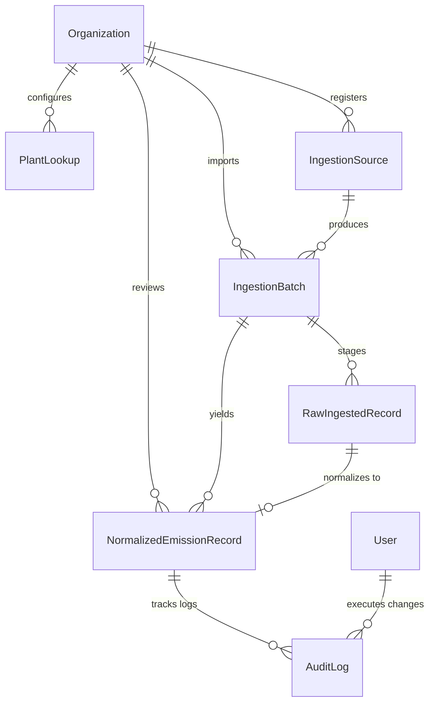

# Data Model Documentation (`MODEL.md`)

This document presents the relational database design for the Breathe ESG Carbon Accounting Data Ingestion platform. It details the schema, relationships, and justifications for why this layout was selected to handle the key requirements: multi-tenancy, Scope 1/2/3 categorization, source-of-truth lineage, unit normalization, and audit ledgers.

---

## 1. Entity Relationship Overview

The database is built on top of a multi-tenant relational structure. It is designed to cleanly separate raw ingestion staging from clean, normalized, auditor-ready emission transactions.

---

## 2. Table Specifications

### A. Core Tenancy & Lookups

#### `Organization` (Tenant Model)
Tracks individual client organizations. Every transaction, plant code, and batch is locked behind an `organization_id` to enforce hard multi-tenant isolation.
* `id` (Auto BigInt, Primary Key)
* `name` (VarChar 255, Unique): Client company name.
* `created_at` (DateTime, AutoNowAdd)

#### `PlantLookup` (SAP Plant Translation)
Translates cryptic SAP plant codes (`WERKS`) to user-friendly physical locations and regional grid associations (crucial for looking up Scope 2 regional electricity factors).
* `id` (Auto BigInt, Primary Key)
* `organization_id` (FK -> `Organization`): Tenancy lock.
* `plant_code` (VarChar 50): e.g., `"1000"`, `"1200"`.
* `name` (VarChar 255): e.g., `"Munich HQ Factory"`.
* `region` (VarChar 100): e.g., `"DE"`, `"US"`, `"IN"`.
* *Constraint*: Unique index on `(organization_id, plant_code)`.

#### `AirportLookup` (Geographic Database)
Stores global airport coordinate coordinates used to compute flight distances dynamically via the **Haversine great-circle formula**.
* `id` (Auto BigInt, Primary Key)
* `code` (VarChar 10, Unique): IATA code, e.g., `"JFK"`, `"LHR"`.
* `name` (VarChar 255): Airport name.
* `latitude` (Float): Latitudinal decimal coordinate.
* `longitude` (Float): Longitudinal decimal coordinate.

---

### B. Ingestion Lineage & Staging

#### `IngestionSource` (Registered Channels)
Represents a source channel configured for the tenant.
* `id` (Auto BigInt, Primary Key)
* `organization_id` (FK -> `Organization`)
* `name` (VarChar 255): e.g., `"SAP ERP Procurement"`.
* `source_type` (VarChar 20): Choice of `SAP` | `UTILITY` | `TRAVEL`.
* `created_at` (DateTime)

#### `IngestionBatch` (Import Batches)
Tracks every file upload or API synchronization. Used by auditors to view the exact batch execution summary.
* `id` (Auto BigInt, Primary Key)
* `organization_id` (FK -> `Organization`)
* `source_id` (FK -> `IngestionSource`)
* `status` (VarChar 20): Choice of `PENDING` | `PROCESSING` | `COMPLETED` | `FAILED`.
* `filename` (VarChar 255): Original name of the ingested CSV/JSON.
* `summary` (JSONField): Aggregates parse results, e.g., `{"parsed": 10, "normalized": 8, "failed": 1, "suspicious": 1}`.
* `created_at` (DateTime)
* `updated_at` (DateTime)

#### `RawIngestedRecord` (Staging Lineage / Source of Truth)
Before parsing, the exact raw CSV columns or JSON payload are stored here. If a row fails schema validation (e.g., date typo), it stays in this table with a list of errors, so analysts can diagnose ingestion issues without breaking the active carbon database.
* `id` (Auto BigInt, Primary Key)
* `batch_id` (FK -> `IngestionBatch`)
* `row_index` (Integer): Row number in the uploaded CSV.
* `raw_data` (JSONField): Exact key-value mapping of original input.
* `validation_errors` (JSONField): Array of string validation issues (e.g. `["Invalid date format: 30.13.2026"]`).
* `status` (VarChar 20): `PENDING` | `NORMALIZED` | `FAILED_VALIDATION`.

---

### C. Golden Target Ledger & Audit Ledger

#### `NormalizedEmissionRecord` (Normalized Gold Target Table)
The core table containing carbon footprint transactions. Tracks both original input values and normalized standard values.
* `id` (Auto BigInt, Primary Key)
* `organization_id` (FK -> `Organization`): Tenancy lock.
* `batch_id` (FK -> `IngestionBatch`): Links record back to upload batch.
* `raw_record_id` (FK -> `RawIngestedRecord`, Nullable): Direct reference to the raw staged row (enables source-of-truth drilldowns).
* `activity_type` (VarChar 50): e.g. `SAP_FUEL`, `UTILITY_ELECTRICITY`, `TRAVEL_FLIGHT`.
* `scope` (VarChar 20): Choice of `Scope 1` | `Scope 2` | `Scope 3`.
* `category` (VarChar 150): GHG protocol categories (e.g., `"Purchased Electricity"`, `"Business Travel"`).
* `activity_date` (Date): Normalized transaction date.
* `description` (Text): Detailed readable text.
* `raw_quantity` (Float): Unmodified input quantity.
* `raw_unit` (VarChar 50): Unmodified input unit (e.g., `"TO"`, `"Wh"`).
* `normalized_quantity` (Float): Converted quantity.
* `normalized_unit` (VarChar 50): Target standard unit (e.g., `"L"`, `"kWh"`, `"km"`).
* `co2e_kg` (Float): Final calculated carbon footprint in kilograms of CO2 equivalent.
* `status` (VarChar 20): Choice of `DRAFT` | `SUSPICIOUS` | `APPROVED` | `AUDITED`.
* `suspicious_reason` (Text, Nullable): Explains validation warnings.
* `audit_locked` (Boolean): If `True`, the record is locked for security and cannot be edited.

#### `AuditLog` (Immutable Audit Ledger)
Tracks every edit, approval, or flag action. Forms the primary evidence for ESG auditors.
* `id` (Auto BigInt, Primary Key)
* `organization_id` (FK -> `Organization`)
* `record_id` (FK -> `NormalizedEmissionRecord`)
* `user_id` (FK -> `django.contrib.auth.models.User`, Nullable)
* `action` (VarChar 100): e.g., `"INGEST"`, `"EDIT"`, `"APPROVE"`, `"LOCK"`.
* `changes` (JSONField): Captures exact before/after field diffs, e.g., `{"raw_quantity": {"old": 500.0, "new": 450.0}}`.
* `comment` (Text, Nullable): Justification comment entered by the analyst.
* `timestamp` (DateTime, AutoNowAdd)

---

## 3. Core Architectural Justifications

1. **Staging vs. Normalized Split**: Storing raw data in `RawIngestedRecord` separately from `NormalizedEmissionRecord` guarantees that malformed files never contaminate clean reports. If a file has 1,000 lines but line 850 has a typo, 999 lines normalize cleanly, while line 850 is staged with error markers. Analysts can fix the typo or ingest a corrected row easily.
2. **Double Quantity Architecture**: By keeping both `raw_quantity` / `raw_unit` and `normalized_quantity` / `normalized_unit`, the auditor can verify the calculations. They can trace:
   $$\text{SAP 2500 L} \rightarrow \text{Normalized 2500 L} \rightarrow \text{2.68 factor} \rightarrow \text{6700 kg } \text{CO}_2\text{e}$$
   This completely avoids "black box" calculations, boosting client trust.
3. **Immutability via Audit Locks**: In ESG reporting, once numbers are signed off, they are frozen. The `audit_locked` boolean prevents any API updates to records marked `AUDITED`, and the `AuditLog` captures a comprehensive historical change ledger for non-locked records.
